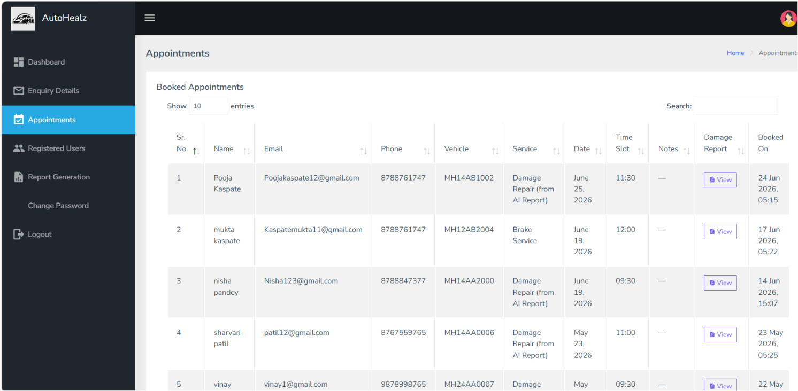
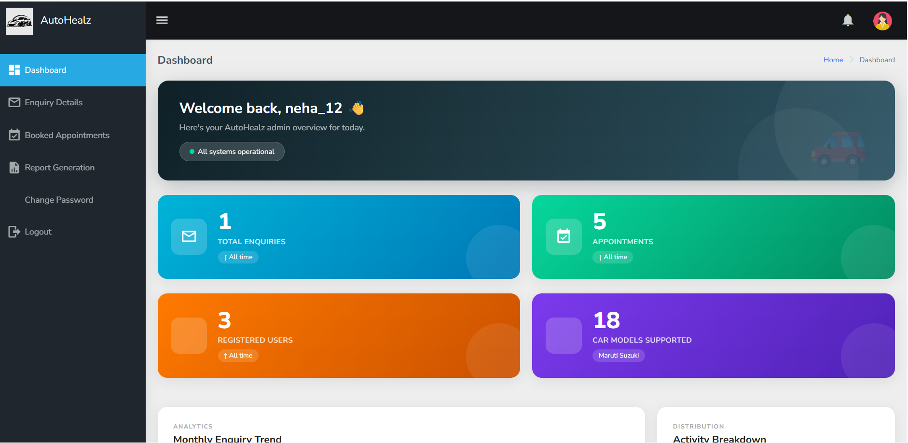
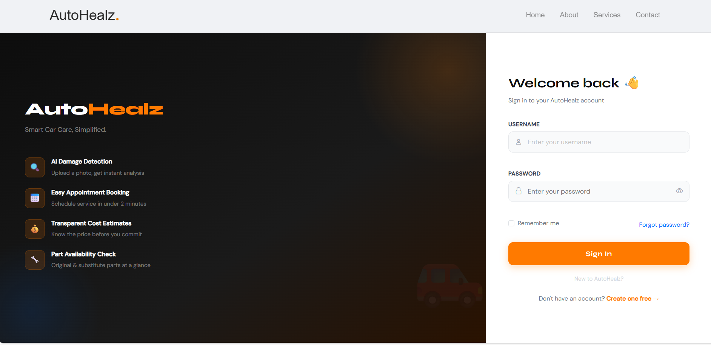

# 🚗 AutoHealz – Cost Estimation of Car Damage Using ML Hybrid Approach

AutoHealz is a Django-based web application that detects damaged car parts from uploaded images and estimates repair costs using machine learning. 
It also provides damage descriptions, part availability, appointment booking, and an admin dashboard for managing the system.

## 🌐 Live Demo
https://autohealz-cost-estimation-of-car-damage.onrender.com

## 📌 Features
- Upload car damage images
- Detect damaged vehicle parts
- Estimate repair costs
- View detailed cost breakdown
- Check part availability
- Book repair appointments
- Admin dashboard

## 🛠️ Technologies Used
- Python
- Django
- HTML, CSS, JavaScript, Bootstrap
- SQLite
- YOLOv8
- KNN

## 📸 Screenshots

### 🏠 Home Page


### 🚗 Cost Estimation


### 💰 Cost Analysis


### 📋 Damage Report


### 📅 Book Appointment


### 📆 Appointments



### 📊 Admin Dashboard



### 🔐 Login



## 🚀 Installation

```bash
git clone https://github.com/sakshiiK30/AutoHealz.git
cd AutoHealz
pip install -r requirements.txt
python manage.py migrate
python manage.py runserver
```

## 👩‍💻 Author
**Sakshi Kaspate**
Bachelor of Engineering – Computer Engineering
